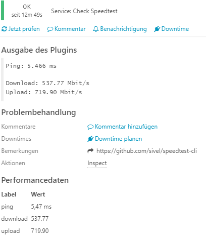
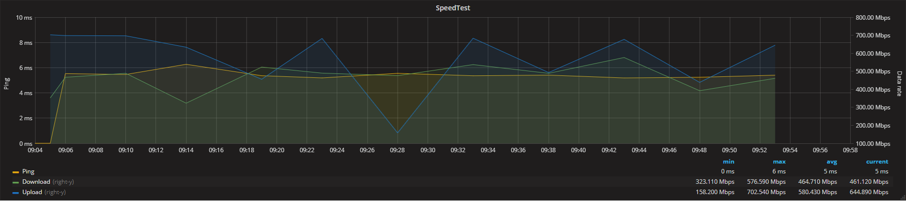

# speedtest-cli

This is a fork of sivel's speedtest-cli with Icinga2 support.
Original repo found under: https://github.com/sivel/speedtest-cli


## Installation
```
wget -O speedtest-cli https://raw.githubusercontent.com/samjaseu/speedtest-cli/master/speedtest-cli
```

## Usage
**Only showing Icinga2 support here.**

### command line
```
$ speedtest-cli --icinga2
Ping: 5.108 ms
Download: 321.87 Mbit/s
Upload: 644.90 Mbit/s
|ping=5.108ms
|download=321.87
|upload=644.90
```

### Icinga2
#### CheckCommand
```
object CheckCommand "command-check-speedtest" {
    import "plugin-check-command"
    command = [ PluginDir + "/speedtest-cli" ]
    arguments += {
        "--icinga2" = {
            order = 0
            required = true
        }
    }
}
```
#### Service template
```
template Service "Check Speedtest Template" {
    check_command = "command-check-speedtest"
    notes_url = "https://github.com/samjaseu/speedtest-cli"
}
```
#### Service check output

#### Grafana speedtest graph

